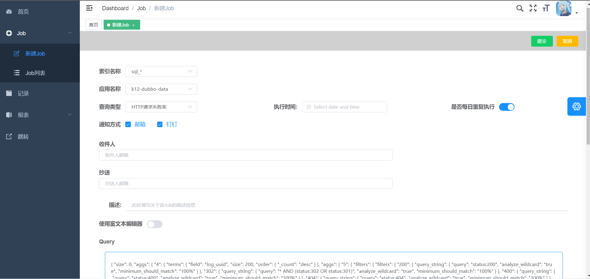
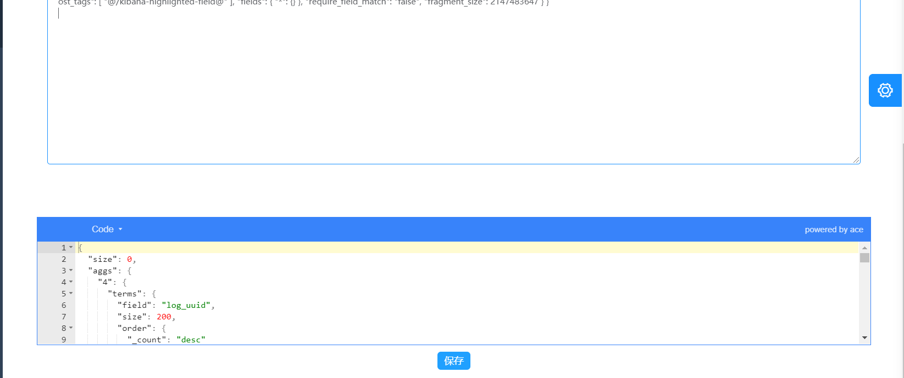
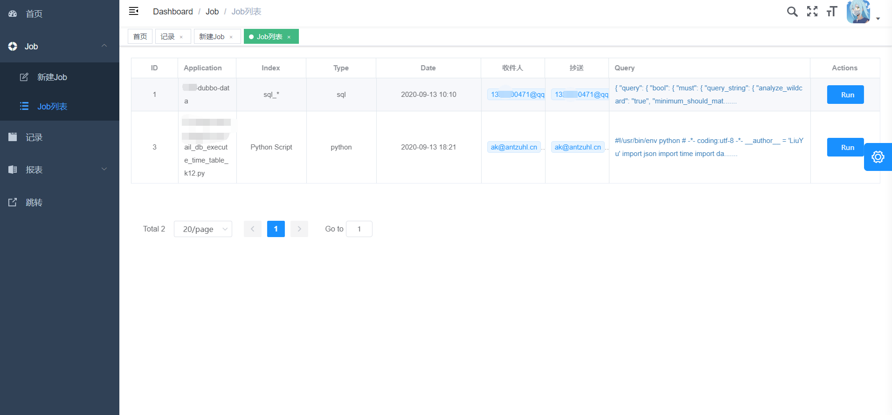
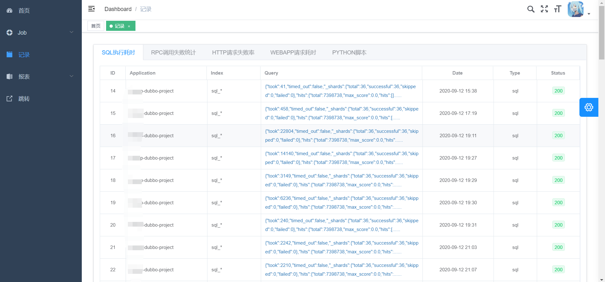
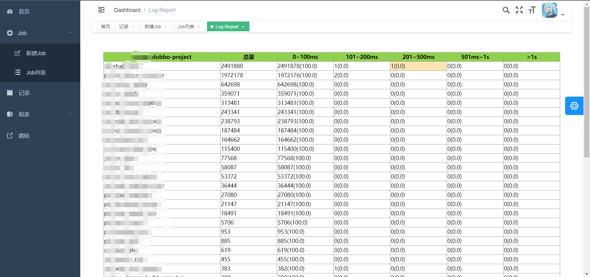
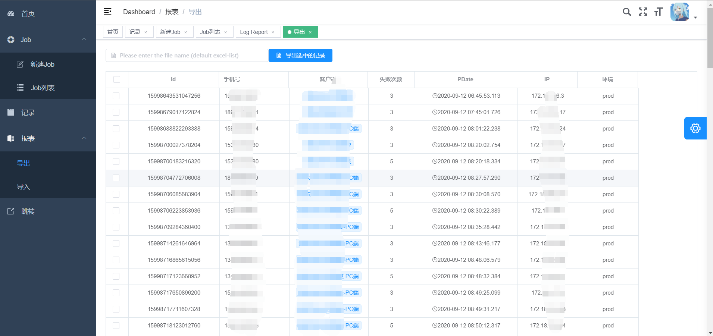

# kibana-eye

> 定时任务执行，发送邮件/钉钉通知 ELK中慢SQL，耗时HTTP，与RPC调用超时统计信息，报表

### 1. 创建定时任务，填写索引名称，通知方式，查询语句(自动生成模板)等

### 2. 现有任务列表，可直接执行

### 3.  历史任务记录，点击跳转报表

### 4. 查看报表详情

### 5. 除了性能监控还可以自定义查询内容，导出excel

### Todo

* 完善解析器种类
* 很多细节待完善